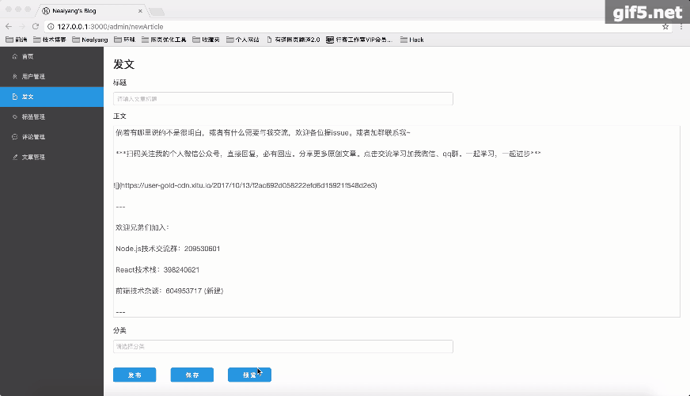
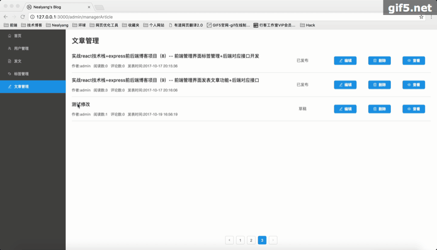

# React技术栈+Express+Mongodb实现个人博客


## 功能描述

***前端部分***

- [x] 文章列表展示ß
- [x] 文章分类
- [x] 登录管理
- [x] 权限管理
- [x] 文章详情页展示
- [x] 管理员文章管理
- [x] 管理员标签管理
- [x] 发文（支持MarkDown语法）

***后端部分***
- [x] mongoose数据库操作
- [x] 路由管理
- [x] 身份验证
- [x] 基本的增删改查
- [x] ...

## 技术栈
- [x] react
- [x] react-redux
- [x] react-router
- [x] redux-saga
- [x] babel
- [x] webpack
- [x] Express
- [x] Mongodb
- [x] Mongoose


## 项目运行效果（Neal处的图，因为UI还没有重做 所以和Neal的原本的UI没啥区别）
- 首页


- 非管理员登录


- 管理员登录


- 标签管理


- 查看文章详情


- 发表文章


- 修改文章



## 项目介绍
根据Neal的博客记录依葫芦画瓢，完成一次React全家桶的系统demo。主要的功能就是博客的展示以及博客的增删改查。


## Neal项目实现步骤系列博客

- [x] [实战react技术栈+express前后端博客项目（0）-- 预热一波](./record/doc/00_预热一波.md)
- [x] [实战react技术栈+express前后端博客项目（1）-- 整体项目结构搭建、state状态树设计](./record/doc/01_整体项目结构搭建、state状态树设计.md)
- [x] [实战react技术栈+express前后端博客项目（2）-- 前端react-xxx、路由配置](https://github.com/Nealyang/React-Express-Blog-Demo/blob/master/record/doc/02_%E5%89%8D%E7%AB%AFreact-xxx%E3%80%81%E8%B7%AF%E7%94%B1%E9%85%8D%E7%BD%AE.md)
- [x] [实战react技术栈+express前后端博客项目（3）-- 后端路由、代理以及静态资源托管等其他配置说明](./record/doc/03_后端路由、代理以及静态资源托管等其他配置说明.md)
- [x] [实战react技术栈+express前后端博客项目（4）-- 博客首页代码编写以及redux-saga组织](./record/doc/04_博客首页代码编写以及redux-saga组织.md)
- [x] [实战react技术栈+express前后端博客项目（5）-- 前后端实现登录功能](./record/doc/05_前后端实现登录功能.md)
- [x] [实战react技术栈+express前后端博客项目（6）-- 使用session实现免登陆+管理后台权限验证](./record/doc/06_使用session实现免登陆+管理后台权限验证.md)
- [x] [实战react技术栈+express前后端博客项目（7）-- 前端管理界面用户查看功能+后端对应接口开发](./record/doc/07_前端管理界面用户查看功能+后端对应接口开发.md)
- [x] [实战react技术栈+express前后端博客项目（8）-- 前端管理界面标签管理功能+后端对应接口开发](./record/doc/08_前端管理界面标签管理功能+后端对应接口开发.md)
- [x] [实战react技术栈+express前后端博客项目（9）-- 前端管理界面发表文章功能+后端对应接口](./record/doc/09_前端管理界面发表文章功能+后端对应接口.md)
- [x] [开发实战react技术栈+express前后端博客项目（10）-- 前端文章列表、路由控制以及对应后端文章管理开发](./record/doc/10_前端文章列表、路由控制以及对应后端文章管理开发.md)
- [x] [实战react技术栈+express前后端博客项目（11）-- 前端文章管理部分完善（修改、预览功能）](./record/doc/11_前端文章管理部分完善（修改、预览功能）.md)
- [x] [实战react技术栈+express前后端博客项目（12）-- 博客添加评论功能以及对应后端实现](http://huziketang.com/books/react/lesson14)
- [x] [实战react技术栈+express前后端博客项目（13）-- pm2的使用说明](https://github.com/jawil/blog/issues/7)
- [x] [实战react技术栈+express前后端博客项目（14）-- 收工](./record/doc/13_收工.md)

## 环境

```
node @7.9.0
db @3.4.0
...
别的就直接npm install 了

注意MongoDB初始化后需要初始化一个admin/admin账户，用于登录后台管理
```

## 运行

    git clone git@github.com:Nealyang/React-Express-Blog-Demo.git
    
    npm i
    
    npm start
    
## Neal开发数据库

> 链接: https://pan.baidu.com/s/1c3aedw8 密码: 5ii1


